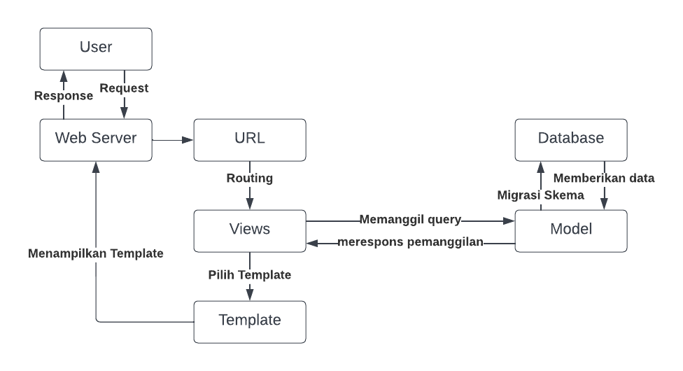

## Link Aplikasi Heroku:
https://tugas2-revanza.herokuapp.com/katalog/

## Buatlah bagan yang berisi request client ke web aplikasi berbasis Django beserta responnya dan jelaskan pada bagan tersebut kaitan antara urls.py, views.py, models.py, dan berkas html;

## Jelaskan kenapa menggunakan virtual environment? Apakah kita tetap dapat membuat aplikasi web berbasis Django tanpa menggunakan virtual environment?
Sesuai dengan namanya, virtual environment berarti adalah sebuah lingkungan bagi projek yang sedang kita kerjakan. Virtual environment berperan sebagai ruang isolasi yang memisahkan antara package dan dependancies dengan aplikasi yang sedang kita kembangkan, hal ini bertujuan agar aplikasi yang sedang kita kembangkan tidak clash dengan versi lain yang ada di local computer. Misalkan kita sedang membuat aplikasi A dengan menggunakan library X, lalu beberapa waktu kemudian kita sedang membuat aplikasi B yang menggunakan library X juga, tetapi library X sudah memiliki versi terbaru dan kita melakukan update library tersebut, jika kita tidak membuat virtual environment, maka dengan melakukan update library, kita akan merusak aplikasi A yang telah kita buat karena aplikasi A dibuat dengan library X versi terdahulu, intinya tidak ada ruang yang memisahkan antara lingkungan aplikasi A dan B. Jadi apakah kita bisa membuat aplikasi tanpa menggunakan virtual environment? Bisa saja, tetapi risikonya seperti yang sudah dijelaskan di atas.

## Jelaskan bagaimana cara kamu mengimplementasikan poin 1 sampai dengan 4 di atas.
Pertama-tama saya mengimport models bernama CatalogItem yang sudah dibuat di file models pada direktori katalog, ini digunakan untuk melakukan pengambilan data dari database. Saya membuat sebuah fungsi pada view.py bernama show_katalog dengan argumen request, di dalam fungsi saya membuat sebuah variable bernama catalog_item_data yang di-assign dengan seluruh objek dari class CatalogItem yang diimport dari file models di direktori katalog. Selanjutnya membuat dictionary bernama context yang berisi pasangan key:value, yaitu pasangan 'list item':catalog_item_data, 'nama':TM Revanza Narendra Pradipta, dan 'npm':2206025003. Setelah itu fungsi akan me-return render(request, "katalog.html", context), dengan me-return ini, maka akan terbuat sebuah file HTML dengan template "katalog.html" yang sudah diisi dengan data-data pada variable context.

Selanjutnya saya membuat sebuah routing pada file urls.py di direktori katalog dengan mengimport fungsi show_katalog dari views di direktori katalog, lalu membuat variabel app_name dan di-assign dengan nama aplikasinya, yaitu 'katalog', kemudian membuat sebuah list bernama urlpatterns yang berisi URLPattern yang didapatkan dari fungsi path sebagai berikut, path('', show_katalog, name='show_katalog'). Lalu di file urls.py yang ada di direktori project_django, saya menambahkan URLResolver dengan mengisi list urlpatterns dengan path('katalog/', include('katalog.urls')).

Selanjutnya saya melakukan mapping data yang telah didapatkan pada fungsi views dan dimunculkan di halaman HTML. Pada file HTML di folder templates pada direktori katalog, saya mengubah Fill me! di dalam HTML tag 
 menjadi {{nama}} atau {{npm}}, lalu untuk menampilkan informasi-informasi item ke tabel, saya melakukan looping terhadap variabel list_item yang sudah dirender ke HTML.

Setelah website sudah dibuat, selanjutnya perlu dilakukan deployment ke Heroku agar bisa diakses di internet, bukan hanya diakses di PC lokal. Pertama-tama saya membuat akun Heroku dan membuat aplikasi dengan nama tugas2-revanza. Lalu, di dalam file Procfile, saya menambahkan skrip berikut, web: gunicorn project_django.wsgi --log-file - , selanjutnya pada berkas dpl.yml di .github/workflows, saya mengisinya dengan baris script yang telah disediakan di website PBP. Selanjutnya pada file settings.py di direktori project_django, saya mengimport os dan menambahkan potongan kode berikut,

PROJECT_ROOT = os.path.dirname(os.path.abspath(__file__))
STATIC_ROOT = os.path.join(PROJECT_ROOT, 'static')

Selanjutnya saya melakukan add, commit, dan push.
Setelah itu, saya menyalin API key dari akun saya. Lalu saya membuat dua repository secret, yang pertama adalah HEROKU_APP_NAME yang berisi tugas2-revanza, yang kedua adalah HEROKU_API_KEY yang berisi API key saya. Terakhir saya menjalankan workflow, jika status deployment sukses, maka aplikasi sudah bisa diakses.
