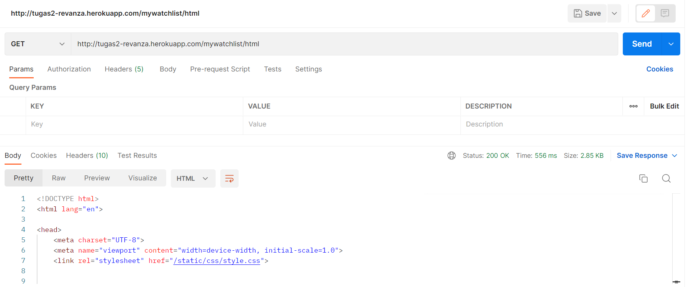
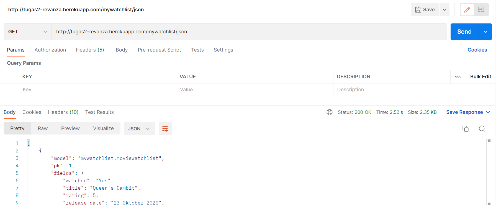
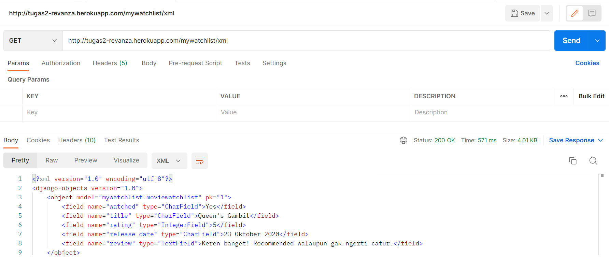

## Link Aplikasi Heroku:
https://tugas2-revanza.herokuapp.com/mywatchlist/

## Jelaskan perbedaan antara JSON, XML, dan HTML!
HTML secara umum memiliki fungsi yang berbeda dibandingkan JSON dan XML, karena selain menunjukkan data, HTML juga merupakan kerangka dari website, dengan HTML, kita bisa mendeskripsikan struktur dari website yang kita inginkan. Sementara fungsi utama dari XML dan JSON adalah untuk menyimpan dan mengirimkan data, tetapi apa perbedaan dari XML dan JSON? Struktur dari XML adalah tree karena memiliki root, branch, dan leaves, sementara struktur dari JSON adalah sebuah pasangan key:value. Secara sintaks, JSON adalah turunan dari object javascript, sementara XML adalah markup language.

## Jelaskan mengapa kita memerlukan data delivery dalam pengimplementasian sebuah platform?
Data delivery sangat esensial digunakan dalam implementasi sebuah platform, sesuai dengan namanya, data delivery merupakan metode untuk mengirimkan data. Implementasinya bisa kita lihat pada tugas 3 ini, saya telah membuat sebuah file json yang berisi data-data list tontonan saya, saat saya mengakses aplikasi yang telah saya buat ini, maka akan ditampilkan list tontonan saya dalam bentuk dokumen HTML di browser, hal ini terjadi karena ada pengiriman data yang dilakukan oleh server saat browser melakukan request data.

Ada juga implementasi lain, browser bisa saja menampilkan raw data dalam format JSON atau XML jika developer telah melakukan implementasi views dengan membuat fungsi untuk menunjukkan data JSON atau XML dan melakukan routing.
 
## Jelaskan bagaimana cara kamu mengimplementasikan checklist di atas.
- views.py
Pada views.py di direktori mywatchlist, saya membuat 5 fungsi baru, yaitu show_html, show_xml, show_xml_by_id, show_json, dan show_json_by_id. Seluruh fungsi tersebut menerima parameter request, untuk fungsi show_xml_by_id dan show_json_by_id ada tambahan parameter id. Fungsi show_html hanya mengembalikan hasil pemanggilan fungsi show_watchlist karena memang isi kontennya sama. Fungsi selain show_html mengembalikan HttpResponse berisi parameter data hasil query yang telah diserialisasi menjadi JSON/XML dan juga parameter content_type="application/json" jika format JSON atau content_type="application/xml" jika format XML, berikut bentuk lebih detailnya:

Jika format XML:
return HttpResponse(serializers.serialize("xml", data), content_type="application/xml")

Jika format JSON:
return HttpResponse(serializers.serialize("json", data), content_type="application/json")

Terlihat di atas bahwa ada argumen data di dalam fungsi serialize. Apa isi dari data? Seperti yang sudah dijelaskan di atas, yaitu sebuah query, isi dari data berbeda tergantung dengan fungsinya. Jika fungsi show_xml dan show_json, maka datanya adalah seluruh objek dari class MovieWatchlist, sementara untuk fungsi show_xml_by_id dan show_json_by_id, datanya adalah objek tertentu saja dari class MovieWatchlist yang ditentukan berdasarkan pk nya.

- urls.py
Sebelumnya di views.py, yang dilakukan adalah mendefinisikan fungsi untuk mengembalikan respons http data dalam bentuk dokumen HTML, format JSON, atau format XML, kita belum bisa menampilkan data tersebut ke browser, oleh sebab itu kita perlu melakukan routing terhadap fungsi views di urls.py. Di sini, saya meng-import seluruh fungsi-fungsi show yang ada di views.py, selanjutnya saya menambahkan path url seluruh fungsi-fungsi yang sudah di-import tadi ke dalam list urlpatterns.

## Mengakses tiga URL di poin 6 menggunakan Postman, menangkap screenshot, dan menambahkannya ke dalam README.md
- HTML

- JSON

- XML
